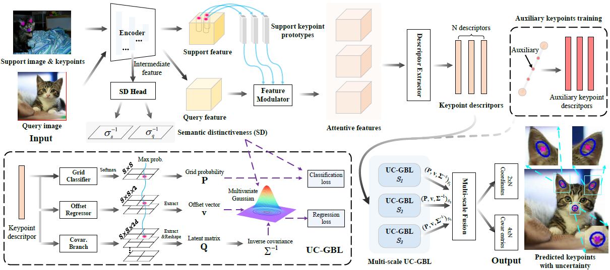

# Few-shot-keypoint-detection
This is the official implementation for the paper [few-shot keypoint detection with uncertainty learning for unseen species](https://openaccess.thecvf.com/content/CVPR2022/html/Lu_Few-Shot_Keypoint_Detection_With_Uncertainty_Learning_for_Unseen_Species_CVPR_2022_paper.html) (CVPR2022).  

For convenience, we show how to train and test the FSKD model only in [Animal pose dataset](https://sites.google.com/view/animal-pose/). 


## 1. FSKD Pipeline  
 

## 2. Requirements.
- Python 3.8.5
- Pytorch 1.7.0

## 3. Model Training
- Download dataset.   
Since the official [Animal pose dataset](https://sites.google.com/view/animal-pose/) has been corrected multiple times by its author due to noisy annotations, the current official one is different from the one which we used. Moreover, the annotation format is different, too. Therefore, we upload the Animal pose dataset that we used on the cloud and please use [this one](https://drive.google.com/file/d/1d1PJWBFjurJltjgyt0LgTENOw0PahZMF/view?usp=sharing). The animal pose dataset should have the folder structure as follows:
    
```angular2html
|--Animal_Dataset_Combined  
   |--gt
   |--images
   |--readme.txt
```

- Modify the dataset path in "annotation_prepare.py" and run this python file to generate the local annotation files. An "annotation_prepare" folder will appear and there are five json files generated as:
```
|--annotation_prepare
   |-- cat.json
   |-- dog.json
   |-- cow.json
   |-- horse.json
   |-- sheep.json
```

- Generate saliency maps using the pre-trained saliency detector [SCRN](https://github.com/wuzhe71/SCRN). The saliency map is used to prune auxiliary keypoints out of foreground region.

- Modify the 'saliency_maps_root' in dict 'opts', and run 'main.py'.  

## 4. Model Testing
- Modify the paths in "eval.py" and run it.


## 5. FAQ
- The testing result may have some variations because it is tested using episodes. Moreover, FSKD is very challenging, so the detector may pose some uncertainty in novel keypoint detection. The scores would be more stable if more episodes are tested.
- The current pipeline is the starting of FSKD. We believe the code will be better along with the research progress of FSKD in the future.

## 6. Citation  
If you use our code for your research, please cite our paper. Many thanks!

```
@InProceedings{Lu_2022_CVPR,
    author    = {Lu, Changsheng and Koniusz, Piotr},
    title     = {Few-Shot Keypoint Detection With Uncertainty Learning for Unseen Species},
    booktitle = {Proceedings of the IEEE/CVF Conference on Computer Vision and Pattern Recognition (CVPR)},
    month     = {June},
    year      = {2022},
    pages     = {19416-19426}
}
```
